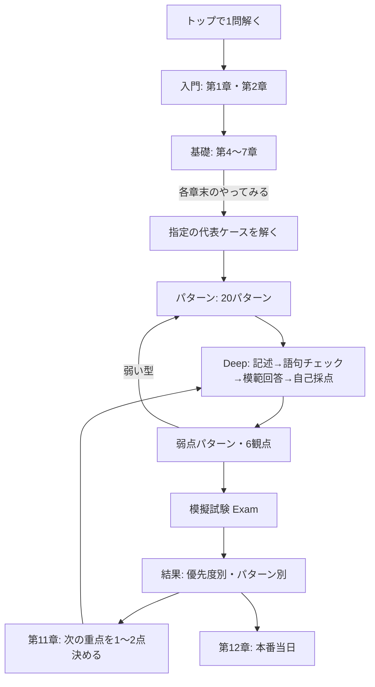

# サイト有用性監査（2026-09-26）

- 対象: https://inbasket-app.com/ の公開60ルートと、`project/front/src`・`scripts/prerender.mjs`・`ref/`
- 方法: 本番の静的HTMLを取得し内部リンクを検査（60ページすべて200、内部リンク42種、リンク切れ0）。390px幅で表示を確認。ソースを精読。
- 前提: Googleは個別の不承認理由を開示しない。以下は根拠を添えた仮説。今回はコードを変更していない。
- `[TODO: 運営者に確認]` は、事実を確認するまで書けない箇所。

## 結論

- 主な原因は文字数不足ではないと考えられる。(1) 何のサイトで、誰がなぜ作ったのかが入口で分からない。(2) 一般的な対策の要約に、根拠のない採点の断定と内部矛盾が混ざる。(3) 記事と演習がつながらず、学習記録も残らない。
- 最大の資産は、ブラウザで解いて記述と模範回答を比べられる演習と、トップの「5件の案件」実践例。これを中心に据え、章・パターン・ケースを演習へつなぐ。
- 先に直すのは信頼性（6軸の不一致、断定、静的HTMLとの不一致、誤リンク）と入口（トップ・運営者情報）。記事の追加は不要。

---

## Phase 1: 監査結果

| ID | 領域 | 問題 | 根拠 |
| --- | --- | --- | --- |
| P-01 | 信頼性 | 「6軸」の定義が2種類ある | 第2章・自己採点: 問題発見力・問題分析力・意思決定力・洞察力・組織活用力・ヒューマンスキル。`/patterns`（表示・静的）と静的HTMLの第2章要約: 判断力・統率力・問題分析力・計画組織力・対人関係力・主体性（「採点6軸」と表記） |
| P-02 | 信頼性 | 公式の採点を知っているかのような断定が残り、第2章「個別の試験の採点表や配点を確認していません」と矛盾 | 表示: 第1章「白紙は0点になりやすい」、第5章「答案での明示が加点ポイント」、第6章「白紙より遥かに高評価」、第7章「組織活用力で大きく減点」、第9章「評価軸の一部」「点数は安定」、パターン9「高評価」。静的HTML: 「すべての評価軸で0点」「合格ラインの目安 40〜50%」「合格目安 30点/40点」「配点目安★★★」「8割決まる」「不合格理由で意外に多い」 |
| P-03 | 整合 | JS実行前の静的HTMLと、利用者が見る本文が違う | `/reference/chapter03` の静的本文は1,794字（`ref/`原稿全文。「3つの帽子」「合格者は」を含む）、表示は799字（要約。含まない）。第1・3〜12章、`/patterns`、`/terms`、パターン・ケース詳細の一部で同様 |
| P-04 | 品質 | 静的HTMLに崩れと誤り | 第10章で模範解答（コードブロック）が消え見出しだけ残り、引用記号「>」が75か所そのまま表示される。番号付きリストが段落に結合。「本書」「この本の使い方」表記。関連リンク名の誤り3件（第2章→「部下のミス報告（パターン2）」、第5章→「緊急トラブル対応（パターン3）」、第7章→「部下への業務委任（パターン4）」。実際の名称と異なる）。`/patterns` の各項目説明が同じ定型文×20 |
| P-05 | 品質 | 表示版の章に自己リンクと誤字 | 「本書全文を読む」が同じページを指す（第3・4・6・7・9・10・11・12章）。第8章「俾瞰」 |
| P-06 | 入口 | 初回訪問で目的・対象・始め方が分からない | 390px の第一画面: H1「インバスケット」、Quick/Deep/Exam、正答0/0、ナビ5個、出題モード、履歴件数、空の履歴。サイト説明は最下部の1文。最初の問題は無作為で上級の場合もある |
| P-07 | 運営者 | 誰が・なぜ・どう作ったかの一次情報がない | `/about` はGitHub IDとAI利用の開示のみ。受験・学習・指導の経験、制作理由、人が確認した範囲の記載なし |
| P-08 | 構造 | 代表ケース20ページ中18ページが孤立 | 静的HTML 60ページの検査で `/cases/` への被リンクは case-001（トップ・第2章）と case-019（トップ）だけ。パターン詳細からケースへのリンクがない |
| P-09 | 導線 | 解説や弱点表示から次の学習へ進めない | 解説後のリンクは `/patterns` と `/reference` の一覧。弱点Top3にリンクなし。レーダーの提案は「chapter06」等の文字のみ。Exam結果にパターン別の分析なし |
| P-10 | 継続 | 学習記録が残らない | 保存は学習スタイルとテーマのみ。回答履歴・自己採点・弱点は再読み込みや他ページへの移動で消える（App がアンマウントされる） |
| P-11 | 演習 | 案件本文が短く、実際の形式の読み取り練習にならない | 70件の本文は42〜89字（平均60字）。発信者・日時・添付資料・関連案件の情報がない |
| P-12 | 演習 | 模擬試験が「本番形式」と言える構成ではない | Exam は70件から無関係な20件を無作為に出題。共通の設定（役職・組織・日付・予定）や案件間の関連がない。`ref/chapter10` には関連案件を含む3演習があるが表示されない |
| P-13 | 演習 | 出題フィルタが正答別で、選ぶと答えが分かる | 「Aのみ/Bのみ/Cのみ」。パターン別・難易度別に練習できない |
| P-14 | データ | ケースとパターンの対応に誤り | case-046・case-062（社内イベント）がパターン7（有給・休暇申請）。解説文も「（パターン7）」。要確認: case-024（新聞社の取材→18 他部署依頼）、case-049（会議室予約→10 予算）、case-056（プロフィール更新→12 会議）。パターン5・8・13・19は案件1件のみ |
| P-15 | 内容 | 章が一般的な対策の要約にとどまり、章同士も重なる | 表示本文は各章800字前後（表・箇条書き・メモ）。重複: 第1⇔3章（思考の対比表）、第4⇔5⇔12章（時間配分）、第6⇔9章（判断・理由・指示）、第10⇔11章（振り返り）、第8章⇔`/patterns`。内部草稿に「検索流入向けに要点のみ約1,300字で再構成」とある |
| P-16 | 方針 | 文字数・ページ数を基準にした改善が続いている | 静的本文1,000字のテスト、`PatternList.tsx` の「本文600字以上を満たす」、PBI-093「800字下限」、プロダクトゴール12「ロングテール検索意図」。Googleは優先する文字数は存在しないと明記 |
| P-17 | 対象 | 想定読者が揃っていない | 第1・3章、パターン9・14は「エンジニア」向け。`/about` は管理職候補一般 |
| P-18 | 技術 | canonical と URL が揃っていない | `/reference/chapter03` は `/reference/chapter03/` へリダイレクト。静的canonicalは末尾なし、JS実行後のcanonical・og:urlは末尾あり。sitemap 43件はすべて末尾なし |
| P-19 | 技術 | sitemap にパターン詳細17件がない | 掲載は1・8・20のみ |
| P-20 | 技術 | 全ページ共通のJSON-LDが古い | 旧ハッシュURL（`#/reference` 等）の BreadcrumbList と WebApplication が全ページに入る。章ページではパンくずが2つになる |
| P-21 | 技術 | JSが重く、表示時に内容が入れ替わる | JS 529KB（全データを同梱）。`createRoot` で静的本文を置き換える。既存記録のローカルLighthouse（モバイル）Performance 77 |
| P-22 | モバイル | Deep の記述欄がはみ出す | 375px幅で14px超過し横スクロール（`width:100%` と padding、`box-sizing` なし） |
| P-23 | 重複 | 規約ページが2つ | `/terms` と `/terms-of-service` が同じ役割。`/terms` に内部事情（`ref/chapter01..12`）の記述 |
| P-24 | ナビ | 主要な行き先が不足し、重複もある | ナビに「模擬試験」「はじめに」がなく「プライバシー」がある。フッターでプライバシー・お問い合わせが2回ずつ |
| P-25 | 名称 | サイト名が揺れる | 「インバスケット - 学習アプリ」「InBusket」「インバスケット学習アプリ」 |
| P-26 | 保守 | CSSのコメントが文字化けしている | `styles.css` のコメント11行に置換文字（U+FFFD）248件。過去の保存で元の文字が失われている（ファイル自体はUTF-8として妥当） |
| P-27 | 内容 | 静的HTMLの休暇申請の回答例が、パターン7の方針と揃っていない | 第10章原稿は業務都合で回答保留・日程振替を相談。パターン7は業務都合だけで機械的に拒否せず、人事・規程を確認する方針 |
| P-28 | 章ページ | 本文の前に12章のカードが並び、見出しも重複 | 各章でh1とh2が同じ文。説明付きの章カード12件が本文の上に出る |

## Phase 2: 優先順位

| 優先度 | ID | 理由 |
| --- | --- | --- |
| Critical | P-01〜P-07 | 信頼性と第一印象。読者にも審査にも最初に見える |
| High | P-08〜P-10、P-12〜P-16、P-18 | 学習が続く構造と独自価値の中核 |
| Medium | P-11、P-17、P-19〜P-24、P-27、P-28 | 改善効果はあるが、上記の後で足りる |
| Low | P-25、P-26 | 保守・表記 |

## Phase 3: 改善案

| 対象 | 原因 | 改善案 | 期待効果 | リスク | 必要な作業 |
| --- | --- | --- | --- | --- | --- |
| P-01・P-02 | 旧原稿の表現が第2章の改訂に追随していない | 6観点を第2章の定義に統一。「加点」「減点」「0点」「合格目安」を削るか「本教材では〜と考える」に置き換える | 公式と独自の区別が一貫し、信頼性が上がる | 断定をやめると説得力が下がると感じる読者がいる | 章データ・パターンデータ・静的HTML生成の文言修正、テスト更新 |
| P-03・P-04・P-27 | 静的HTMLが `ref/` 原稿と独自要約を使い、表示は別データを使う | 静的HTMLも表示と同じデータから生成する。原稿の有用な部分（第10章の演習、第3章の視点）は事実確認のうえ表示側へ移す | 利用者とクローラーが同じ本文を見る。崩れ・誤りが消える | 静的HTMLの文字量は一時的に減る | `prerender.mjs` の章生成を `referenceData.ts` 由来に変更、スナップショット更新 |
| P-05 | 「全文」へのリンク先が存在しない | 自己リンク8件を削除し「この章の練習」に置き換える。誤字修正 | 雑な印象の解消 | なし | `referenceData.ts` |
| P-06 | 演習UIをそのままトップにした | D案のとおり、目的・対象・始め方を第一画面に出し、操作設定は演習パネル内へ | 初訪問者が迷わない | 常連の操作手順が変わる | `App.tsx`・`HomeStudyGuide`・静的HTML |
| P-07 | 運営者の一次情報が未提供 | G案の項目を運営者が埋める。事実がない項目は書かない | 誰が・なぜ・どうが明確になる | 個人情報の出しすぎ | 運営者の回答→`siteInformation.json` |
| P-08・P-09 | ページを検索向けに個別に作り、学習の順で結んでいない | H案のリンクを追加。一覧ではなく該当ページへ | 孤立ページ解消、演習と学習が循環 | リンク過多（1か所3件程度に抑える） | `PatternDetail`・`CaseDetail`・`ExplanationView`・`WeaknessPatternTop3`・`RadarChart` |
| P-10 | 保存しない設計のまま | 回答履歴・自己採点をブラウザ内に保存し、消去ボタンを付ける | 学習を続ける理由ができる | プライバシーポリシーの改訂が必要。共有端末 | domain層の保存処理、ポリシー改訂 |
| P-11・P-12 | 1件ずつの分類練習から出発した | F案のシナリオ型演習（共通設定＋関連案件）を追加。Exam でも選べるようにする | 本サイトを使う理由の中核になる | 作成の負担。架空の例であることの明示が必要 | 案件作成・人による確認・データ構造追加 |
| P-13 | 初期要件（優先度別フィルタ）のまま | パターン別・難易度別の出題に変更 | 弱点パターンを狙って練習できる | 既存の正答別集計の扱い | `random.ts`・`ModeSelector` |
| P-14 | 20分類に定型事務・広報の型がない | 誤りを修正し、合わない案件は分類を見直す | 弱点分析の正確さ | 集計結果が変わる | `patternWeakness.ts`・`cases.json`・テスト |
| P-15 | 要約版として作った | E案の学習コースに再構成し、重複章は統合を検討。各章末に「やってみる」を置く | 読むだけで終わらない | URLは維持し、統合時は転送方法を決める | 章データの再編 |
| P-16 | 文字数を審査基準と誤解しやすい運用 | 文字数下限を目的にしたPBI-093は取り下げを提案。1,000字テストは本文欠落の検知としてのみ残す | 読者第一の判断に戻る | なし | バックログ整理 |
| P-17 | 原稿がエンジニア向けの書籍草稿 | 対象を決める `[TODO: 運営者に確認]`。一般向けなら表現を揃え、エンジニア向けなら入口で明示 | 読者像が一貫する | どちらかの読者を狭める | 方針決定→文言修正 |
| P-18〜P-21 | GitHub Pages の配信仕様と旧設定の名残 | I案のとおり | インデックスの安定 | URL変更時の再クロール | `Router.tsx`・`routes.ts`・`index.html`・ビルド |
| P-22〜P-26・P-28 | 小さな実装・表記の問題 | J案の候補で修正 | 使いやすさ・保守性 | なし | 各ファイル |

## Phase 4: 実装

今回は「コードを変更せず監査」の指示に従い未実施。候補は J に記載。

---

## A. 不合格原因の仮説

| # | 仮説 | 根拠 | Googleの観点 |
| --- | --- | --- | --- |
| 1 | 入口でサイトの目的と独自の価値が伝わらない | P-06。サイト説明は最下部の1文 | サイトに主要な目的があるか。独自の価値 |
| 2 | 一般的な対策の要約に見え、一次情報がない | P-15、P-07。時間配分・判断の型・委任の要素は他の対策書でも読める内容。経験に基づく記述がない | 独自の情報や分析があるか。価値を付加せず要約していないか。経験がないのにニッチな話題を扱っていないか |
| 3 | 自動生成の痕跡と内部矛盾が信頼性を下げている | P-01、P-02、P-04、P-05、P-14。AI利用を開示している中で、確認不足に見える誤りが複数ある | 明らかな事実誤認はないか。雑に作られた印象はないか |
| 4 | クローラーが取得するHTMLと表示本文が違う | P-03。意図的なクローキングではないが、利用者と検索エンジンに異なる本文を出す状態に見える | ユーザーと検索エンジンに同じ内容を出す |
| 5 | ページが学習の順につながらず、検索流入だけを狙ったページに見える | P-08、P-09。孤立したケース18ページはsitemapからしか到達できない | 継続的なキュレーションと構造。ユーザーの関心を維持するか |
| 6 | 学習アプリとしての価値が浅く、使い続ける理由が弱い | P-10〜P-13 | 信頼できるツール・サービスを提供しているか |
| 7 | 文字数とページ数で改善してきた | P-16。静的本文を600字以上にした後も同じ判定（order018）。その後も1,000字基準で量を増やした | 特定の文字数を狙って書いていないか |
| 8 | 運営者の実在性と一貫した名称が弱い | P-07、P-25。運営者はGitHub IDのみ。ウェブ上の他の活動は `[TODO: 運営者に確認]` | ウェブ上で一貫したプレゼンスがあるか |

可能性が低いもの: 到達性・基本設定。60ページすべて200、リンク切れ0、`ads.txt`・`robots.txt`・404・法務ページは整っている。技術面の修正だけで判定が変わるとは考えにくい。

## B. ページ別監査表

分類: 維持／改善／統合検討／noindex検討。削除の提案はしない。

### トップ・一覧・章

| URL | タイトル | 問題 | 対応 |
| --- | --- | --- | --- |
| `/` | インバスケット - 学習アプリ | 入口の説明なし。演習UIが先頭。実践例「5件の案件」は独自性が高い | 改善（最優先） |
| `/reference` | 解説リファレンス | 12章の羅列。段階・前提・演習がない | 改善（学習コースの入口に） |
| `/reference/chapter01` | インバスケットとは何か | 一般的な説明。典型設定に出典なし。エンジニア向け。第3章と表が重複 | 改善・第3章と統合検討 |
| `/reference/chapter02` | 採点基準を逆算する | 独自性あり（公式との区別、答案比較）。題名が内容と逆。静的要約の6軸が誤り | 維持（題名と静的要約を修正） |
| `/reference/chapter03` | マネージャー思考への切替 | 第1章と重複。自己リンク。静的HTMLだけ「3つの帽子」 | 統合検討 |
| `/reference/chapter04` | 時間配分とタイムマネジメント | 本サイトの目安を事実のように記載。第5・12章と重複。自己リンク | 改善 |
| `/reference/chapter05` | 優先順位づけの技術 | 「加点」「配点効率」。B-1/B-2がアプリのA/B/Cと不一致。静的リンク名誤り | 改善 |
| `/reference/chapter06` | 意思決定フレームワーク | 「遥かに高評価」。第9章と重複。静的HTMLは別の5段階 | 改善 |
| `/reference/chapter07` | 委任と組織活用の技術 | 「大きく減点」。静的HTMLに根拠のない割合。静的リンク名誤り | 改善 |
| `/reference/chapter08` | 案件パターン別攻略 | `/patterns` と役割が重なる。4分類の表のみ。誤字 | 統合検討（`/patterns` へ） |
| `/reference/chapter09` | 答案の書き方と文章技術 | 「評価軸の一部」「点数は安定」。Deep の記述と連動していない | 改善 |
| `/reference/chapter10` | 模擬試験の進め方 | 表示は表1つ。原稿の3演習は非表示。静的HTMLで模範解答欠落・合格目安 | 改善（演習化） |
| `/reference/chapter11` | 弱点分析と継続改善 | アプリの弱点機能と連動していない。第10章と重複 | 改善 |
| `/reference/chapter12` | 本番当日の戦略 | 一般的な受験の心得。「8割」等 | 改善・第4章と統合検討 |
| `/patterns` | パターン別解説 | 6軸の誤表記。「頻出」に根拠なし。静的HTMLに定型文×20。自分の弱点から選べない | 改善 |

### パターン詳細（20件）

共通: 代表ケース・練習・関連章へのリンクがない。一覧の優先度の目安と代表ケースの分類が違う場合の説明が要る。独自の深掘り解説があるため、いずれも維持しつつ導線を改善する。

| URL | タイトル | 問題（案件数・代表ケース） | 対応 |
| --- | --- | --- | --- |
| `/patterns/1` | 顧客クレーム | 3件・case-001 | 改善 |
| `/patterns/2` | 取引先からの要求 | 5件・case-053 | 改善 |
| `/patterns/3` | 新規取引・営業案件 | 3件・case-017 | 改善 |
| `/patterns/4` | 部下の退職・異動の相談 | 2件・case-010 | 改善 |
| `/patterns/5` | 部下間の対立 | 1件・case-015。一覧はB、代表ケースはA | 改善 |
| `/patterns/6` | 部下のパフォーマンス問題 | 3件・case-042 | 改善 |
| `/patterns/7` | 部下の有給・休暇申請 | 4件（うち2件は社内イベントで誤り）・case-019。公的資料リンクあり | 改善（対応修正） |
| `/patterns/8` | ハラスメント報告 | 1件・case-004 | 改善 |
| `/patterns/9` | プロジェクト遅延・品質問題 | 4件・case-029。「高評価」、エンジニア前提 | 改善 |
| `/patterns/10` | 予算承認・経費申請 | 7件・case-035。会議室予約ルール・様式変更など予算と無関係な案件が混在 | 改善 |
| `/patterns/11` | 業務改善提案 | 4件・case-016 | 改善 |
| `/patterns/12` | 会議・セミナーへの参加依頼 | 8件・case-002。プロフィール更新など無関係な案件が混在 | 改善 |
| `/patterns/13` | 事故・災害報告 | 1件・case-018 | 改善 |
| `/patterns/14` | 情報セキュリティインシデント | 5件・case-013。エンジニア前提の表現 | 改善 |
| `/patterns/15` | コンプライアンス違反 | 3件・case-039 | 改善 |
| `/patterns/16` | 組織変更・人員配置 | 3件・case-048 | 改善 |
| `/patterns/17` | 上位方針の伝達・対応 | 2件・case-012 | 改善 |
| `/patterns/18` | 他部署からの依頼・調整 | 7件・case-037。新聞社の取材が混在 | 改善 |
| `/patterns/19` | 前任者の未完了案件 | 1件・case-021 | 改善 |
| `/patterns/20` | 複合案件 | 3件・case-031。トップの実践例と結び付けられる | 改善 |

### 代表ケース詳細（20件）

共通: 本文（約60字）より解説（約1,500字）が主役で、「解く」導線がない。パターン詳細とは本文が異なるため、統合せず役割（型と実例）を分ける。

| URL | タイトル | 問題 | 対応 |
| --- | --- | --- | --- |
| `/cases/case-001` | 主要顧客から大型クレームの電話 | 被リンクあり（トップ・第2章） | 改善（解く導線） |
| `/cases/case-002` | 社内勉強会の開催案内 | 孤立 | 改善 |
| `/cases/case-004` | ハラスメント相談の申告 | 孤立 | 改善 |
| `/cases/case-010` | ベテラン担当者の急な退職申し出 | 孤立 | 改善 |
| `/cases/case-012` | 本部長から中期戦略レビュー資料の依頼 | 孤立 | 改善 |
| `/cases/case-013` | 情報セキュリティインシデント疑い | 孤立 | 改善 |
| `/cases/case-015` | 部下二人の対立 | 孤立 | 改善 |
| `/cases/case-016` | 部下からの業務改善提案 | 孤立 | 改善 |
| `/cases/case-017` | 新規取引候補の打診 | 孤立 | 改善 |
| `/cases/case-018` | 倉庫での労災事故報告 | 孤立 | 改善 |
| `/cases/case-019` | 部下からの有給休暇申請 | 被リンクあり（トップ） | 改善（解く導線） |
| `/cases/case-021` | 前任者が放置していた顧客クレーム | 孤立 | 改善 |
| `/cases/case-029` | 主要プロジェクトで品質問題が発覚 | 孤立 | 改善 |
| `/cases/case-031` | 海外子会社の品質問題と現地メディア対応の同時発生 | 孤立 | 改善 |
| `/cases/case-035` | 名刺発注の在庫確認 | 孤立 | 改善 |
| `/cases/case-037` | 他部署から月次報告フォーマット改定の周知 | 孤立 | 改善 |
| `/cases/case-039` | 匿名通報窓口へのコンプラ違反疑義通報 | 孤立 | 改善 |
| `/cases/case-042` | 高成果メンバーの燃え尽き兆候と離職示唆 | 孤立 | 改善 |
| `/cases/case-048` | 次四半期の採用計画ドラフト依頼 | 孤立 | 改善 |
| `/cases/case-053` | 取引先からの契約更新書類の軽微修正依頼 | 孤立 | 改善 |

### 運営・法務

| URL | タイトル | 問題 | 対応 |
| --- | --- | --- | --- |
| `/about` | 運営者情報 | AI利用・非公式の開示は良い。誰が・なぜ・どう作るかがない | 改善（TODO） |
| `/terms` | サービス利用規約 | `/terms-of-service` と重複。内部事情の記述 | 統合検討 |
| `/terms-of-service` | 利用規約 | `/terms` と重複 | 統合検討（統合しない場合は一方をnoindex検討） |
| `/privacy-policy` | プライバシーポリシー | 実装と一致 | 維持（学習記録を保存する場合は改訂） |
| `/contact` | お問い合わせ | 公開のIssueのみ | 維持（非公開窓口は運営者判断） |
| 404 | ページが見つかりません | HTTP 404・noindex・導線あり | 維持 |

## C. サイト構造

### 現在

```text
/  演習UI ＋ 実践例「5件の案件」
├─ /reference ─ /reference/chapter01〜12（演習への導線なし）
├─ /patterns ─ /patterns/1〜20（ケースへのリンクなし）
├─ /cases/case-xxx ×20（18件は孤立）
└─ /about /contact /privacy-policy /terms /terms-of-service
ナビ: 問題回答｜解説リファレンス｜パターン別解説｜運営者情報｜プライバシー
```

### 改善後（URLは原則維持）

```text
/  入口: 何のサイトか・対象・無料・始め方 → STEP1〜6 → 1問解く → 実践例
├─ 学ぶ /reference（入門 → 基礎 → 実践 → 振り返り → 本番）
│   └─ /reference/chapterXX（要点 → よくある失敗 → やってみる → 次の章）
├─ 型を知る /patterns（自分の正答率つき20パターン）
│   └─ /patterns/N（型 → 失敗 → 代表ケース → このパターンを練習）
│       └─ /cases/case-xxx（問題 → 解く → 解説 → 同じパターンの次の問題）
├─ 解く（Quick・Deep。パターン別・難易度別）
├─ 模擬試験（Exam。段階的にシナリオ型へ）
├─ 振り返る（学習記録。弱点パターンと6観点）
└─ このサイトについて /about（運営者・理由・作り方・編集方針・改訂履歴）
ナビ: はじめに｜学習コース｜案件パターン｜問題演習｜模擬試験｜学習記録
フッター: 運営者情報・編集方針｜お問い合わせ｜プライバシー｜利用規約
```

新しいURL（模擬試験・学習記録など）を作るかは要承認。まずはトップ内の区画で対応できる。

## D. TOPページ改善案

### ファーストビュー（390px の1画面）

1. H1: インバスケット学習アプリ
2. 説明1文: 架空の案件で、優先順位・委任・判断理由の書き方を練習できる無料のWeb教材です。登録は不要です。
3. 対象: インバスケット形式の演習が初めての方、昇進・登用の試験や研修を控えた方（`/about` の想定読者と一致させる）
4. ボタン: 「1問解いてみる」（初級・Quick）／「学習の進め方を見る」
5. 注記1行: 分類と回答例は本教材独自のもので、実際の試験の公式正答・配点ではありません（第2章へ）

正答カウンタ・出題モード・履歴件数は演習パネルの中へ移し、初回は折りたたむ。

### その下の構成

| 順 | 区画 | 内容 |
| --- | --- | --- |
| 1 | 学習ステップ | STEP1 インバスケットとは（第1章）→ STEP2 基礎（第4〜7章）→ STEP3 案件パターン（`/patterns`）→ STEP4 問題を解く（Quick→Deep）→ STEP5 答案を振り返る（第2章の6観点・自己採点）→ STEP6 弱点を改善（弱点パターン→再挑戦→模擬試験）。各カードに「何をするか」とリンク。学習記録の保存後は完了チェックを表示 |
| 2 | できること | 実数のみ: 12章・20パターン・70問、Quick/Deep、Exam（20問90分）、記述の語句チェック・模範回答・6観点の自己採点 |
| 3 | 演習エリア | 既存アプリ。出題はパターン別・難易度別へ |
| 4 | 解説の例 | 既存の「5件の案件」実践例（独自性が高いため維持） |
| 5 | このサイトについて | 運営者と作った理由の要約 `[TODO: 運営者に確認]` と `/about` へのリンク |
| 6 | 最近の改訂 | 実際の改訂だけを日付つきで3件 |

入れないもの: 利用者数・合格率・体験談・レビュー。静的HTMLも同じ構成で生成する。

## E. 学習導線



1. トップの「1問解いてみる」で初級を1問（例: case-019 休暇申請）→ 解説から第1章へ
2. 入門: 第1章 → 第2章（以後の振り返りで使う6観点を知る）
3. 基礎: 第4〜7章。章末で指定パターンの代表ケースを Deep で1問
4. パターン: `/patterns` から気になる型 → 代表ケース → 同じ型を数問
5. 記述: 第9章 → Deep で記述 → 語句チェック → 模範回答と比較 → 自己採点
6. 模擬試験: 第10章 → Exam → 結果から弱点パターンへ
7. 振り返り: 第11章 → 学習記録で重点を1〜2点決め、Deep へ戻る
8. 本番前: 第12章 → 残り時間ごとの行動を Exam で試す

レベル分け（入門1〜3章／基礎4〜7章／実践8〜10章／振り返り11章／本番12章）は概ね妥当。調整点: 第1章と第3章の統合、第2章を振り返りでも参照、第8章は `/patterns` と一体化、第12章は第4章との統合も検討。各レベルの最後に演習課題を置き、読むだけで先へ進ませない。

## F. 独自性強化案

### 既存の資産を強める

| 案 | 内容 | 根拠となる既存資産 |
| --- | --- | --- |
| 条件変更ドリル | 代表ケースごとに「条件が変わると分類と初動がどう変わるか」を1〜2問（例: 値引き8%→3%） | トップ実践例の「条件が変わったら、判断も変える」 |
| 時刻入りの初動点検 | 「誰が・いつ・何を・報告時刻・約束しないこと」を Deep の自己点検に表示 | トップ実践例の「自分の答案を見直す4つの問い」 |
| シナリオ型演習 | 共通の設定（役職・権限・予定）と関連案件を含む演習。Exam でも選べる | `ref/chapter10` の3演習（断定を除き、模範解答を復元して使う） |
| 関連の気づき | シナリオ演習で「同一人物・部署」の関連に気づけたかを振り返る | 既存の関連ハイライト機能 |
| 自分の学習記録 | パターン別正答率と6観点の推移をブラウザ内に表示 | 既存の弱点Top3・レーダー（保存を追加） |
| 透明な作り方 | AIと人の役割、改訂履歴、誤り報告の反映をサイト上に示す | `/about` の開示と公開リポジトリの履歴 |
| 運営者の一次情報 | 経験がある範囲だけを記載 | `[TODO: 運営者に確認]` |

内容の新規作成（案件・ドリル）は要承認。作らないもの: 架空の受験・合格体験、利用者数、合格率、レビュー、FAQや記事の量産。

## G. 運営者情報・編集方針

### 現在あるもの

目的、想定読者、作成方針（架空の問題・非転載・AI利用）、非公式であること、GitHub ID、連絡先（Issues）、更新方針、利用条件・データの取り扱い。

### 不足しているもの

| 項目 | 現状 | 追加案 |
| --- | --- | --- |
| 運営者の紹介 | GitHub ID のみ | 表示名と立場 `[TODO: 運営者に確認]` |
| インバスケットとの関係 | なし | 受験・学習・研修の経験の有無と範囲 `[TODO: 運営者に確認]` |
| 作った理由 | なし（依頼記録に「隙間時間で繰り返し学習したい」「自学自習を支援」） | 運営者本人の言葉で `[TODO: 運営者に確認]` |
| なぜWebアプリ・なぜ無料か | なし | `[TODO: 運営者に確認]` |
| 作り方 | 「AIを草案作成と実装に利用」のみ | 工程ごとのAIと人の役割、人が確認した範囲 `[TODO: 運営者に確認]` |
| 参考資料 | 一部ページに公的資料 | 参考にした資料の種類 `[TODO: 運営者に確認]` |
| 改訂履歴 | 本文1段落とGitHubへのリンク | サイト内に実際の改訂を日付つきで |
| 今後の予定 | なし | 実際に予定している改善のみ `[TODO: 運営者に確認]` |
| 広告の位置付け | プライバシーポリシーに記載 | 無料提供と広告の関係を1文 `[TODO: 運営者に確認]` |
| 名称 | 表記揺れ | 表記の統一 `[TODO: 運営者に確認]` |

勤務先・実名など本人が特定される情報は、本人の判断なしに追加しない。

### `/about` の構成案（見出し）

1. このサイトについて
2. 運営者 `[TODO]`
3. このサイトを作った理由 `[TODO]`
4. 想定する学習者
5. 教材の作り方（AIと人の役割）`[TODO]`
6. 公式情報・一般的な知識・本サイトの方法の区別
7. 更新と誤りの訂正（改訂履歴）
8. 連絡先

## H. 内部リンク改善

方針: 学習の次の一歩だけをリンクする。一覧より該当ページへ。1か所3件程度まで。リンク数を増やすこと自体は目的にしない。

| リンク元 | リンク先 | 目的 |
| --- | --- | --- |
| 解説表示 | 該当パターン詳細、同じパターンの次の問題 | 解いた型を理解して反復 |
| 弱点Top3 | 各パターン詳細、そのパターンを練習 | 弱点 → 学習 → 演習 |
| 6観点レーダー | 最も低い観点に対応する章（章名で表示） | 振り返り → 学習 |
| Exam結果 | 誤答の多いパターン、第11章 | 模試 → 改善 |
| パターン詳細 | 代表ケース、このパターンを練習、関連章 | 型 → 実例 → 演習 |
| ケース詳細 | この問題を解く（Deep）、同じ型、関連章 | 読む → 解く |
| 章末 | 「やってみる」（指定ケース）、次の章 | 読む → 解く → 次へ |

委任の例: 第7章 → パターン3・18（委任先と範囲）→ case-017・case-037 → Deep（アクション欄に担当・期限・報告・裁量）→ 第9章 → 自己採点「組織活用」→ 弱点 → 第7章へ戻る。

削除・置換: 「本書全文を読む」の自己リンク8件、フッターの重複行、解説表示の一覧リンク。

## I. 技術的改善

技術面の修正だけで判定が変わるとは考えない。

| 項目 | 現状 | 問題 | 対応 | 優先度 |
| --- | --- | --- | --- | --- |
| title | ルート別に一意 | トップの題名で内容が伝わらない。名称の揺れ | 名称を統一し、トップは内容を表す題名に | Medium |
| meta description | 章・パターン・ケースは定型文に名称を差し込む | 各ページで学べることが分からない | ページ固有の要約へ（誇張・語句の羅列なし） | Medium |
| canonical | 静的は末尾なし、JS実行後は末尾あり | 不一致。リダイレクトするURLを指す | 最終URL（末尾あり）に統一。または `.html` 出力で末尾なしを200にする | High |
| sitemap | 43件、末尾なし | すべてリダイレクト。パターン17件がない | 最終URLで公開ページを網羅 | High |
| robots.txt | 全許可＋sitemap | なし | 維持 | - |
| OGP | 全ページ512pxアイコン、`summary_large_image` | 画像の比率が合わない | 横長画像か `summary` カード | Low |
| schema.org | 全ページに WebApplication・WebSite・旧URLの BreadcrumbList | 旧URLと重複 | 共通分はトップのみ、旧パンくずを削除。PBI-092 は内容の整合後 | Medium |
| パンくず | 章・パターン・ケースにあり | 章でh1とh2が同文 | 見出しの整理 | Low |
| 404 | HTTP 404・noindex・導線 | なし | 維持 | - |
| リンク切れ | 静的HTMLで0件 | 表示版に自己リンク8件、静的HTMLに誤ったリンク名3件 | P-04・P-05 で修正 | Critical |
| モバイル | 記述欄が14pxはみ出す | 横スクロール | `box-sizing: border-box` | Medium |
| CWV（LCP・CLS） | JS 529KB 単一、静的本文を置換 | 初回表示で内容が入れ替わる | ルート単位の分割。静的本文を表示と同じ構造にする | Medium |
| 画像・lazy loading | アイコンのみ | 対象なし | 図解が必要ならSVG | - |
| アクセシビリティ | 既存記録で100（ローカル） | A/B/Cの◎○△が記述チェックの記号と紛らわしい | 記号の見直しを検討 | Low |
| CSS | 47KB | コメントの文字化け | 元の説明を履歴から復元するか削除 | Low |
| noscript | 全ページにh1 | h1が重複 | h1 を段落に | Low |

## J. 実装

### 実施状況

監査時点ではコード変更なし。2026-09-26 に下表9件を実施した（テスト64ファイル・1,255件成功、型検査・ESLint・ビルド成功）。

### 承認後に実施した明白な修正（意味を変えない小規模修正）

| # | 内容 | ファイル | 対応ID |
| --- | --- | --- | --- |
| 1 | 記述欄に `box-sizing: border-box` | `src/styles.css` | P-22 |
| 2 | 誤字「侾瞰」→「俯瞰」 | `src/data/referenceData.ts` | P-05 |
| 3 | 「本書全文を読む」自己リンク8件を削除 | `src/data/referenceData.ts` | P-05 |
| 4 | 静的HTMLの誤った関連リンク3件を、表示版と同じパターン（17・10・3）と実名に修正。リンク名の「（chapterXX）」を「（第X章）」に | `scripts/prerender.mjs` | P-04 |
| 5 | 6軸の表記を第2章の6観点に統一し「採点6軸」を「振り返りの6観点」に | `src/pages/PatternList.tsx`・`src/pages/ReferencePage.tsx`・`scripts/prerender.mjs`・深掘り解説2か所 | P-01 |
| 6 | 旧ハッシュURLの BreadcrumbList を削除 | `index.html` | P-20 |
| 7 | 解説表示の「関連パターンを見る」を該当パターン詳細へ | `src/ui/ExplanationView.tsx` | P-09 |
| 8 | フッターの重複リンクを整理 | `src/App.tsx` | P-24 |
| 9 | sitemap に全20パターンを追加 | `src/routes.ts`・`public/sitemap.xml` | P-19 |

### 確認後に実施（データや意味が変わる）

- case-046・case-062 のパターン対応（P-14）: PO 確認
- 断定表現の書き換え（P-02）: 文面の確認
- 静的HTMLの単一ソース化（P-03）: 方針の確認
- トップ改修（P-06）と `/about`（P-07）: TODO への回答後

---

## 付録1: 初訪問者の10の質問

| # | 質問 | 現状の答え | 評価 |
| --- | --- | --- | --- |
| 1 | 何のサイトか | 最下部の1文と `/about` | × |
| 2 | 誰向けか | `/about` の想定読者のみ | × |
| 3 | 何ができるか | Quick/Deep/Exam の補足（ホバー・読み上げ） | △ |
| 4 | どこから始めるか | 案内なし | × |
| 5 | 無料で何ができるか | 最下部の「無料の学習教材」 | △ |
| 6 | 何が身につくか | 各章の学習ゴールのみ | △ |
| 7 | どれから読むか | `/reference` の1段落 | △ |
| 8 | 模擬試験はどこか | ヘッダーの「Exam」ボタンのみ | × |
| 9 | 弱点をどう確認するか | 3問回答後に弱点Top3、自己採点後にレーダー。保存なし | △ |
| 10 | 学習を続ける導線 | 記録なし・次のおすすめなし | × |

## 付録2: 5分間使った場合の評価

| 観点 | 評価 | 理由 |
| --- | --- | --- |
| 何のサイトか理解できる | △ | 題名と「インバスケット学習アプリ」の小見出しのみ |
| 学習を開始できる | ○ | すぐ問題を解ける。ただし上級や3つの記述欄から始まることがある |
| 次に何をするか分かる | × | 解説後のリンクが一覧 |
| 独自性を感じる | △ | 実践例と記述の比較は良い。章は一般論 |
| 無料の価値を理解できる | △ | 説明が最下部 |
| 続ける理由がある | × | 記録が消える |
| このサイトを使う理由がある | △ | ブラウザで解けて記述を比べられる点は強いが、見せ方が弱い |

## 付録3: 内容の区分

区分: FACT（一般・確認可能）／SITE METHOD（本サイトの方法）／EXAMPLE（架空の例）／USER ACTION（利用者が行う練習）。表示時に小さなラベルで区別することを提案する。

| コンテンツ | FACT | SITE METHOD | EXAMPLE | USER ACTION |
| --- | --- | --- | --- | --- |
| トップ実践例 | - | 期限から逆算した初動、条件変更、4つの問い | 営業課長の5件 | 4つの問いで答案を点検 |
| 第1章 | 架空の立場で未処理案件を時間内に処理する形式。実施形式は実施者で異なる | プレイヤーとマネージャーの対比 | なし | なし（1問解くを追加） |
| 第2章 | 評価項目は実施者で異なる | 6観点、A/B/C分類 | 納品不具合の2答案 | 根拠の一文を探す |
| 第4章 | 制限時間は実施者で異なる（60〜90分等は「例」と明記） | A4〜5分・B3分・C1〜2分 | なし | Exam で配分を試す |
| 第5章 | 緊急度と重要度で分ける考え方は一般的な時間管理の手法 | A/B/C判定、30秒チェック | なし | Quick |
| 第6章 | - | 判断・理由・指示、仮判断と再評価 | なし | Deep |
| 第7章 | - | 委任の4要素 | なし | Deep のアクション欄 |
| パターン20件 | 法令が関わる案件の公的資料（一部） | 20分類、優先度の目安、回答の骨格 | 回答例文 | 代表ケース → 同じ型を練習 |
| 第9章 | - | 結論を先に、主語と期限を明示 | なし | 記述チェック |
| 第10章 | - | 模試の3段階 | 原稿の3演習（未表示） | Exam |
| 第11章 | - | 記録 → 採点 → 原因 → 対策 | なし | 弱点Top3・レーダー |
| 第12章 | 一般的な受験準備 | 残り時間ごとの行動 | なし | Exam で試す |
| ケース20件 | - | A/B/C分類例、モデル回答 | 全件架空 | 解く |

## 付録4: 運営者への確認事項

1. 運営者の表示名と立場（公開できる範囲）
2. インバスケットとの関係（受験・学習・研修の経験の有無と範囲）
3. サイトを作った理由（依頼記録の「隙間時間で繰り返し学習したい」は運営者本人の動機か）
4. Webアプリにした理由、無料にした理由、広告の位置付け
5. AIと人の役割（案件・解説の作成、人が確認した範囲）
6. 想定読者をエンジニア出身者に寄せるか、一般に揃えるか
7. `ref/` の原稿を書籍やブログなど他所で公開しているか（重複の確認）
8. 名称の統一（InBusket／インバスケット学習アプリ）
9. 学習記録をブラウザに保存してよいか（プライバシーポリシーの改訂を含む）
10. `/terms` と `/terms-of-service` の統合方針
11. 非公開の連絡手段を設けるか
12. 公開してよい今後の改善予定
